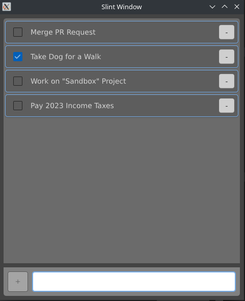

# TODO App #
Yes, everyone has one. Everybody has done it, but I had to start
somewhere.

This project uses Slint as the frontend with the lower functionality
in Rust, naturally. It's purpose is to track tasks that need to be
done at a later time.



To run the application all that needs to be done is to use `cargo`.
```sh
$ cargo run .
```
